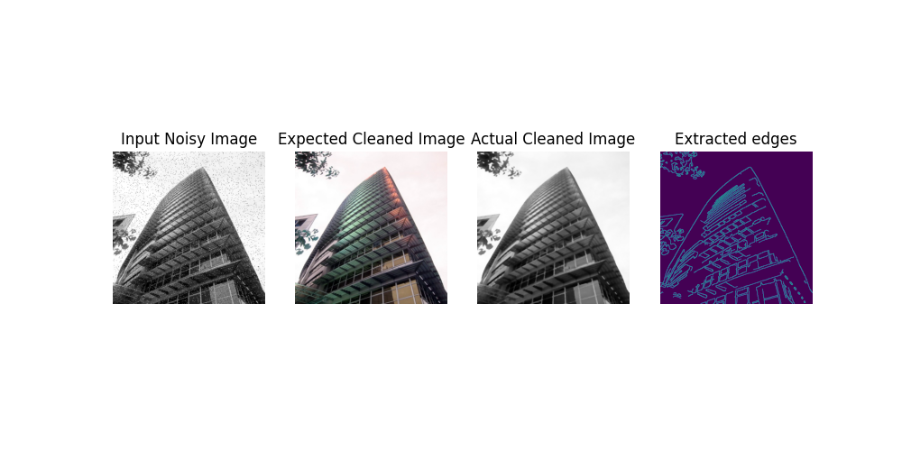

# mpi-image-multiprocessing

## This project is a simple demonstration of the image multiprocessing capabilities of Message Passing Interface (MPI) in python using the mpi4py package.

This project showcases a simple method to speed up image processing on large image datasets using the mpi4py package. Images were taken from the [Salt and Pepper Noise Dataset in Kaggle](https://www.kaggle.com/datasets/rajneesh231/salt-and-pepper-noise-images). This dataset provides 300 noisy images (Noisy_folder) and their corresponding expected clean images (Ground_truth). Using mpi4py, the dataset is split into n components and n processes are created to run on those components and perform image processing. Using opencv, the noisy images are cleaned and edge detection is performed on them. 

## File Description
1. <strong>multiprocessing_images.py</strong> is the main multiprocessing program and implements mpi4py to split the dataset into n components and process them in n parallel processes. This program reads the noisy images, performs processing and then saves the results in the <code>mpi_res</code> folder created by it. This program also displays some metrics including the time taken by each process on its component, the maximum time taken (which is also the total execution time since this is parallel processing), and the average time taken by the processes.

2. <strong>simple_image_processing.py</strong> is written for comparison. This program performs the same image processing tasks as multiprocessing_images.py but without multiprocessing and then saves the results in the <code>simple_res</code> folder created by it. This program outputs its total execution time for comparison with the multiprocessing approach.

By executing both programs, you can easily compare and infer how much faster image processing is when mpi4py is used. 

## Setup and Execution Instructions

1) This project uses Microsoft MPI. Follow the instructions given [here](https://learn.microsoft.com/en-us/message-passing-interface/microsoft-mpi) to install MS MPI
2) Install the mpi4py package using pip. For more details, visit [this](https://pypi.org/project/mpi4py/)
3) Download the [Salt and Pepper Noise Dataset](https://www.kaggle.com/datasets/rajneesh231/salt-and-pepper-noise-images) from Kaggle. Make sure you have the Ground_truth and Noisy_folder folders in your project folder.
4) Now you are ready to run the multiprocessing program! Go to your terminal and run the <code>mpiexec -n 5 python multiprocessing_images.py</code> command to execute the multiprocessing_images.py program. Here 5 denotes the number of parallel processes. You can specify a number of your choice.
5) Now run the simple_image_processing.py program either by executing it directly or by typing <code>python simple_image_processing.py</code> in the terminal.
6) Compare the execution time of the simple image processing and the max time of the multiprocessing to find the extent to which your processing has been sped up.
7) You can also view the time taken by each parallel process.

## Expected Output

Apart from the execution time metrics, the programs also store the results of their corresponding image processing tasks in the mpi_res and simple_res folders. The results are in the form of matplotlib subplots consisting of the following 4 plots:

1. The <strong>Input Noisy Image.</strong>
2. The corresponding <strong>Expected Clean Image.</strong> (Ground truth)
3. The <strong>Actual Cleaned Image</strong> generated by the code.
4. The <strong>Extracted Edges</strong> from the cleaned image.

## Final thoughts

This is a fun little project that I have made in college to show the capabilities of parallel processing for image processing tasks. Feel free to suggest any changes or use this for any of your projects as well. You can also star this repo if you found it useful!
